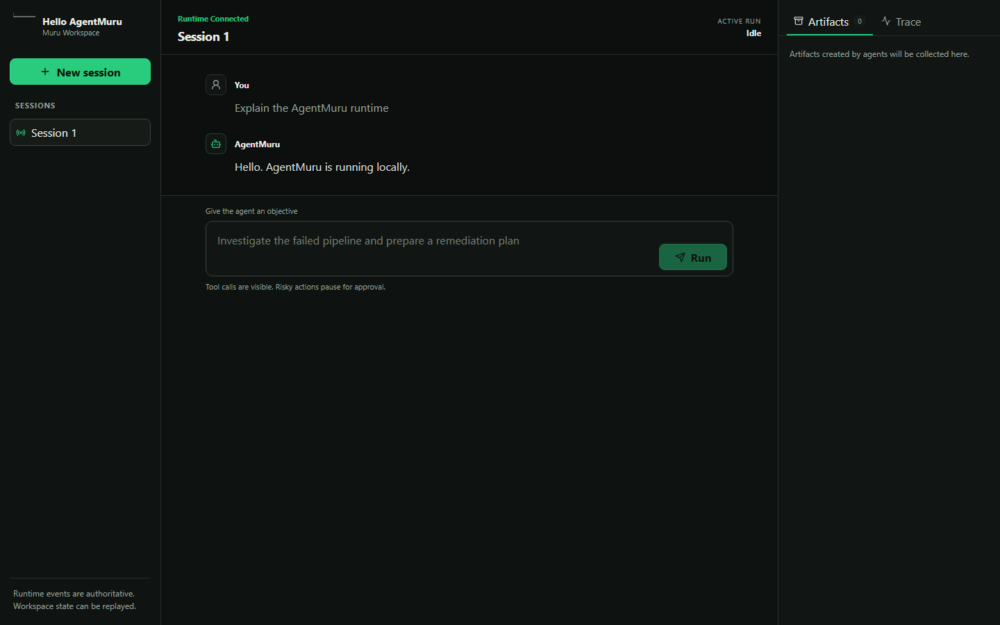

---
hide:
  - navigation
  - toc
---

<section class="muru-hero">
  <div>
    <h1>Build agents you can see, steer, and trust.</h1>
    <p>One Python runtime for model calls, governed tools, durable state, and an operator-ready workspace.</p>
    <div class="muru-actions">
      <a class="md-button md-button--primary" href="getting-started/quickstart/">Run the quickstart</a>
      <a class="md-button" href="getting-started/real-model/">Connect a model</a>
    </div>
  </div>
  <figure class="muru-hero__visual">
    
  </figure>
</section>

<div class="muru-install">
  <p><strong>Start locally.</strong><br>No credential is required for the first run.</p>

```powershell
python -m pip install agentmuru==0.3.0
muru init my-agent
```
</div>

## Choose what you need

<div class="muru-paths">
  <article>
    <h3>Run the MVP</h3>
    <p>Create a project, send a message, inspect its timeline, and reopen the session.</p>
    <a href="getting-started/quickstart/">Follow the quickstart</a>
  </article>
  <article>
    <h3>Use a real model</h3>
    <p>Choose OpenAI, Anthropic, or Google without changing runtime code.</p>
    <a href="getting-started/real-model/">Configure a provider</a>
  </article>
  <article>
    <h3>Build governed behavior</h3>
    <p>Turn typed Python functions into tools, require permissions, pause risky work for approval, and replay every decision.</p>
    <a href="cookbook/governed-tools/">Build a governed tool</a>
  </article>
</div>

## One explicit execution path

<div class="muru-flow">
  <div><strong>Message</strong><span>Persist user intent</span></div>
  <div><strong>Model</strong><span>Stream normalized events</span></div>
  <div><strong>Policy</strong><span>Check permission and risk</span></div>
  <div><strong>Tool</strong><span>Approve and execute</span></div>
  <div><strong>Timeline</strong><span>Replay the result</span></div>
</div>

AgentMuru records the assistant message and its complete tool calls before it stores tool
results. That ordering keeps provider conversations valid across replay, restart, and a later
model turn.

## What ships in 0.3

| Area | Included |
| --- | --- |
| Runtime | Agents, normalized model events, tools, permissions, approvals, cancellation, handoffs |
| Providers | OpenAI Responses, Anthropic Messages, Google Gen AI, deterministic `FakeModel` |
| State | In-memory stores and durable SQLite sessions, events, artifacts, approvals, idempotency |
| Operator surface | FastAPI HTTP API, WebSocket event stream, bundled browser Workspace |
| Operations | Health endpoint, trusted hosts, origin controls, trace spans, usage, recovery codes |

<div class="muru-boundary">
  <strong>Clear boundary.</strong> The PyPI package is the supported Python-first MVP. Native
  compilation, adaptive routing, and local-model catalog work live under <a href="labs/">Labs</a>.
</div>

## Continue from here

- [Understand agents and models](concepts/agents-and-models.md)
- [Persist sessions with SQLite](operations/sqlite.md)
- [Read the Python API reference](reference/public-api.md)
- [Check current capabilities and limits](integration-status.md)
